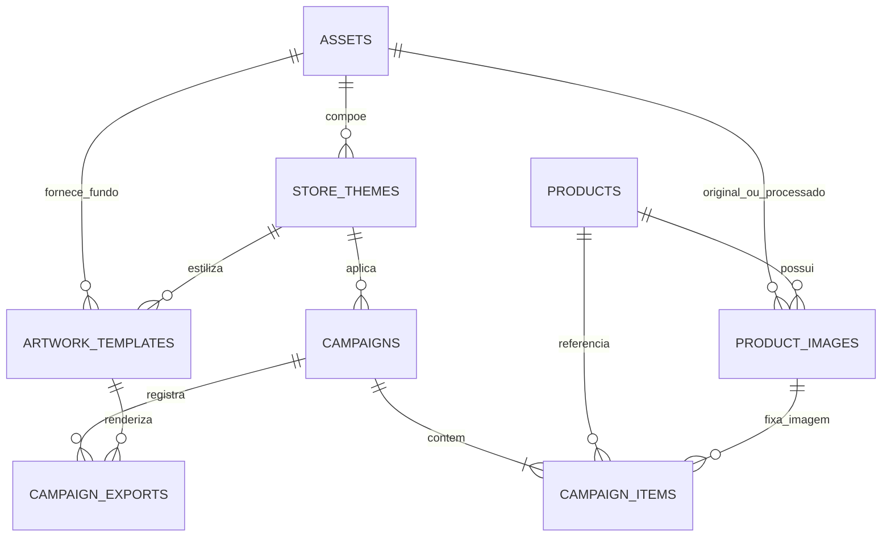

# Plano de implementação — persistência do catálogo e das campanhas no Supabase

**Data:** 6 de setembro de 2026  
**Estado:** schema e fronteira local concluídos; primeiro produto real validado; persistência de campanha retirada do corte atual pela decisão de 7 de setembro
**Projeto remoto alvo:** `supabase_catalogo`  
**Estado remoto confirmado:** nove tabelas essenciais criadas, RLS nas nove, bucket privado criado, sete funções de domínio; primeiro produto real confirmado pelo usuário e nenhum template Feed
**Primeiro recorte funcional:** preservar integralmente o Story de um produto já validado e tornar seus dados recuperáveis após recarga  
**Feed:** estrutura prevista no banco, sem template ativo e sem seed até o usuário entregar e aprovar a base visual

## Registro de execução — 6 de setembro de 2026

> **Escopo revisado em 7 de setembro:** depois do primeiro teste real bem-sucedido, o usuário decidiu manter no Supabase somente produto e foto aprovada. Os incrementos de campanha e exportação auditável abaixo permanecem como histórico de planejamento, mas não devem ser implementados no corte atual. A continuidade está em [`2026-09-07-catalogo-reutilizavel-busca-e-nova-oferta.md`](2026-09-07-catalogo-reutilizavel-busca-e-nova-oferta.md).

- **Incremento 0 concluído:** portão documental aprovado, repositório Git inicializado e baseline preservado.
- **Incremento 1 concluído com ressalva operacional:** schema, constraints, índices, funções, RLS e bucket foram criados no projeto correto; o roteiro SQL transacional chegou a `ok 34`. Como o MCP desta conversa não expôs `apply_migration`, a aplicação ocorreu pelo SQL Editor em transação única e o histórico `list_migrations` continua vazio. Reconciliar antes do próximo DDL.
- **Incremento 2 implementado e testado localmente:** cliente server-only, repositório específico, API local de produtos, validação de payload/erros e variáveis Supabase sem prefixo `VITE_`.
- **Incremento 4 concluído para o primeiro fluxo Story/1:** classificação nome/GTIN antes da rede, texto apenas local, GTIN local-first, limite 12, formulário manual, upload durável no bucket privado, `assets`, associação primária aprovada, `activate_product` e recuperação posterior por nome. O clique de exportação, depois da confirmação humana, é provisoriamente o gatilho explícito de validação do produto/foto. A continuidade separará nome canônico e nome exibido sem persistir campanha.
- **Incremento 7 implementado no código/schema:** reserva e consulta de cota Cosmos passaram para funções atômicas do banco; o arquivo legado não é mais escrito. Falta smoke test com credencial server-only configurada.
- **Incrementos 3, 5 e 6 pendentes:** seed de ativos/tema/Story, campanha/revisão e exportação auditável. A exportação local já bloqueia o download até a ativação do produto, mas ainda não grava `campaign_exports` porque tema/template/campanha não foram persistidos.
- **Incremento 8 parcial:** 26 arquivos/188 testes e build passaram. O smoke remoto confirmou ativação, ativo recuperável e busca por nome; depois da limpeza técnica, o primeiro ensaio real foi concluído e o Nescau foi confirmado pelo usuário no catálogo.

## 1. Decisão de produto e alteração explícita de fase

Este plano descreve uma evolução **posterior ao MVP técnico local já testado**. A especificação original proíbe backend, nuvem e banco remoto dentro do MVP. O pedido de 6 de setembro de 2026 abre uma nova fase: manter a interface em `localhost`, mas persistir catálogo, ativos aprovados, templates, campanhas e registros de exportação no projeto Supabase dedicado.

Esta exceção não autoriza silenciosamente:

- autenticação ou cadastro de usuários;
- multitenancy, múltiplos supermercados ou múltiplas lojas;
- hospedagem pública da interface;
- editor visual livre;
- ERP, estoque, planilha, leitura por câmera ou publicação automática;
- cobrança, métricas de vendas ou automações de marketing;
- implementar Feed antes de existir um template visual limpo e aprovado;
- aplicar migrações no projeto remoto antes da aprovação deste plano.

**Decisão adicional aprovada em 6 de setembro de 2026:** busca textual deixa de ser uma descoberta externa. Produto novo só entra por EAN/GTIN exato ou por cadastro manual explícito. Depois de validado, salvo e ativado no catálogo próprio, ele passa a ser encontrável por nome.

Antes da implementação, a especificação canônica e `docs/CONTEXTO_ATUAL.md` deverão receber uma atualização curta e explícita registrando esta fase. A arquitetura continua single-tenant e assistida: um supermercado, uma aplicação local e um projeto Supabase dedicado.

## 2. Resultado esperado

Ao final desta implementação:

1. O aplicativo continuará abrindo em `http://127.0.0.1:4173/` e o Story atual não sofrerá regressão visual.
2. Busca por nome retornará exclusivamente produtos ativos do catálogo próprio, sem consultar Open Food Facts, Cosmos ou outra fonte externa.
3. A imagem aprovada de cada produto será durável, terá procedência e geometria registradas e não dependerá de URL temporária da Kie ou de fonte externa.
4. Uma campanha em rascunho poderá ser retomada após recarga do navegador.
5. A revisão e a exportação só usarão uma versão persistida e validada da campanha.
6. Cada exportação registrará um instantâneo imutável dos dados comerciais e do template usado.
7. O limite diário do Cosmos deixará de depender do arquivo local `data/cosmos-usage.json` e será reservado atomicamente no banco.
8. O banco terá suporte estrutural a Story/Feed e 1/4/8 produtos, mas somente a combinação realmente validada poderá ficar ativa.
9. O Feed continuará exibindo o placeholder atual enquanto não existir um registro de template ativo para ele.
10. Um produto ainda não cadastrado será descoberto somente por EAN/GTIN exato; a alternativa sem código será um cadastro manual deliberado e validado.

## 3. Princípios que governam o desenho

### Exatidão comercial

Produto, imagem, apresentação, unidade e preços permanecem ligados por chaves e restrições. O banco recusa preço promocional menor ou igual a zero, preço anterior menor ou igual ao promocional, produto duplicado na mesma campanha e posição duplicada.

### Entrada controlada de produtos

Nome serve para recuperar o que o supermercado já cadastrou, não para vasculhar catálogos externos. Um texto nunca dispara Open Food Facts ou Cosmos. Para um item novo, o caminho padrão é EAN/GTIN exato, que identifica um SKU com muito menos ambiguidade; quando não houver código utilizável, existe uma ação separada de cadastro manual. Em ambos os casos, o produto só fica pesquisável por nome depois da revisão de metadados, apresentação e imagem e da ativação da linha no catálogo.

### Histórico reproduzível

O cadastro do produto pode ser corrigido no futuro, mas uma exportação antiga não pode mudar retroativamente. Por isso, `campaign_items` guarda os valores usados na campanha e `campaign_exports` guarda o snapshot normalizado da revisão exportada.

### Ativos fora do Postgres

PNG, JPEG, WebP, logos, fundos e fontes não serão gravados como Base64 ou `bytea` nas tabelas. Os binários ficarão em um bucket privado do Supabase Storage; o Postgres guardará identidade, caminho, MIME, dimensões, hash e relacionamentos.

### Interface local e segredo no servidor local

Sem autenticação, conceder escrita direta ao papel `anon` tornaria o banco gravável por qualquer pessoa que obtivesse a URL e a chave pública. Portanto, o navegador falará apenas com rotas locais do Vite. Essas rotas usarão uma credencial do Supabase mantida em `.env.local`, nunca com prefixo `VITE_` e nunca enviada ao bundle.

### SVG continua sendo a fonte da arte

O banco fornece dados, ativos e regras versionadas. O React continua montando uma árvore SVG única, usada tanto pela prévia quanto pela exportação. Nenhum HTML separado será criado para exportar.

### Nenhuma entidade especulativa

Não serão criadas tabelas de usuários, organizações, assinaturas, lojas, estoque, publicações sociais ou permissões de equipe. Novas tabelas só entram quando um fluxo aprovado realmente as consumir.

## 4. Arquitetura alvo

```text
Navegador em 127.0.0.1:4173
  ├─ estado transitório do formulário
  ├─ SVG compartilhado de prévia/exportação
  └─ /api/catalogo/* (mesma origem)
                ↓
Servidor Vite local
  ├─ valida payloads e transições
  ├─ mantém SUPABASE_URL e credencial secreta fora do bundle
  ├─ conversa com Supabase Database/Storage
  └─ preserva proxies atuais de OFF, Cosmos e Kie
                ↓
Supabase do projeto supabase_catalogo
  ├─ Postgres: catálogo, campanhas, templates, auditoria e cota
  └─ Storage privado: imagens, logo, fundos e fontes aprovados
```

O MCP é uma ferramenta administrativa para aplicar e inspecionar migrações. Ele não é dependência de execução do aplicativo.

## 5. Modelo relacional essencial



### 5.1 `assets`

Registro de todo arquivo durável armazenado no bucket privado.

| Coluna | Tipo | Regra |
| --- | --- | --- |
| `id` | `uuid` | PK, `gen_random_uuid()` |
| `kind` | `text` | `product_original`, `product_processed`, `logo`, `template_background` ou `font` |
| `bucket` | `text` | obrigatório; inicialmente `catalog-assets` |
| `object_path` | `text` | obrigatório e único junto com `bucket`; nunca URL assinada |
| `mime_type` | `text` | whitelist de PNG/JPEG/WebP/TTF/OTF conforme `kind` |
| `byte_size` | `bigint` | maior que zero e limitado pela regra do servidor |
| `sha256` | `text` | 64 caracteres hexadecimais; deduplicação e verificação |
| `width_px` | `integer` | obrigatório para imagem; positivo |
| `height_px` | `integer` | obrigatório para imagem; positivo |
| `created_at` | `timestamptz` | preenchido pelo banco |

Não guardar URL temporária ou assinada. A URL de leitura será produzida sob demanda pela rota local.

### 5.2 `store_themes`

Identidade visual separada dos produtos e das regras de layout. Apesar do plural técnico, o primeiro ciclo terá somente um tema ativo.

| Coluna | Tipo | Regra |
| --- | --- | --- |
| `id` | `uuid` | PK |
| `slug` | `text` | único e estável |
| `name` | `text` | nome administrativo do tema |
| `store_name` | `text` | nome exibido do supermercado |
| `version` | `integer` | positivo; versões publicadas não são alteradas em lugar |
| `status` | `text` | `draft`, `active` ou `retired` |
| `logo_asset_id` | `uuid` | FK opcional para `assets`; obrigatório ao ativar |
| `primary_color` | `text` | hexadecimal `#RRGGBB` |
| `secondary_color` | `text` | hexadecimal `#RRGGBB` |
| `accent_color` | `text` | hexadecimal `#RRGGBB` |
| `background_color` | `text` | hexadecimal `#RRGGBB` |
| `text_color` | `text` | hexadecimal `#RRGGBB` |
| `display_font_family` | `text` | obrigatório |
| `display_font_asset_id` | `uuid` | FK opcional para `assets` |
| `body_font_family` | `text` | obrigatório |
| `body_font_asset_id` | `uuid` | FK opcional para `assets` |
| `price_font_family` | `text` | obrigatório |
| `price_font_asset_id` | `uuid` | FK opcional para `assets` |
| `created_at`, `updated_at` | `timestamptz` | mantidos pelo banco |

Índice parcial garante apenas um tema `active`. Os onze botões sazonais atuais não serão inseridos: hoje são placeholders visuais, não temas funcionais.

### 5.3 `products`

Cadastro canônico dos produtos aceitos pelo operador.

| Coluna | Tipo | Regra |
| --- | --- | --- |
| `id` | `uuid` | PK |
| `gtin` | `text` | opcional, único quando presente, 8/12/13/14 dígitos e dígito verificador válido |
| `canonical_name` | `text` | obrigatório; pode ser mais longo que o nome do cartaz |
| `brand_name` | `text` | opcional |
| `default_quantity` | `numeric(12,3)` | maior que zero e no máximo 9.999 |
| `default_unit` | `text` | `g`, `kg`, `ml`, `L` ou `unidade` |
| `registration_method` | `text` | `gtin_lookup` ou `manual` |
| `metadata_origin` | `text` | `openfoodfacts`, `cosmos`, `curadoria_interna` ou `manual` |
| `search_text_normalized` | `text` | mantido pelo banco a partir de nome e marca; sem acentos e em minúsculas |
| `status` | `text` | `draft`, `active` ou `archived`; somente `active` aparece na busca por nome |
| `created_at`, `updated_at` | `timestamptz` | mantidos pelo banco |

`gtin` é obrigatório quando `registration_method = gtin_lookup` e pode ser nulo no cadastro manual de um item sem código. O nome curto usado na arte não substitui `canonical_name`; ele é salvo em `campaign_items.display_name` para respeitar o contrato específico do layout. Uma função de ativação recusa produto sem apresentação válida e sem imagem primária aprovada.

As extensões `unaccent` e `pg_trgm` serão habilitadas por migração. Um trigger controlado pelo banco mantém `search_text_normalized`; um índice GIN trigram atende nome/marca com tolerância a acentos e pequenas variações. A consulta limita a resposta inicial a 12 produtos já cadastrados, priorizando nome exato, prefixo e só depois similaridade. Esse limite reduz ruído de interface, mas não substitui a identidade por GTIN quando houver código.

### 5.4 `product_images`

Relaciona um produto à imagem aprovada, preservando procedência e geometria da silhueta.

| Coluna | Tipo | Regra |
| --- | --- | --- |
| `id` | `uuid` | PK |
| `product_id` | `uuid` | FK obrigatória para `products` |
| `source_origin` | `text` | `openfoodfacts`, `cosmos`, `gs1`, `curadoria_interna` ou `upload_usuario` |
| `source_url` | `text` | opcional; apenas HTTPS validado; nunca usado como ativo final |
| `original_asset_id` | `uuid` | FK opcional para `assets` |
| `processed_asset_id` | `uuid` | FK obrigatória para `assets` do PNG aprovado |
| `processing_method` | `text` | `alpha_preserved`, `deterministic_cutout` ou `kie` |
| `pipeline_version` | `text` | identifica as regras usadas no recorte/análise |
| `source_width_px`, `source_height_px` | `integer` | dimensões positivas do PNG final |
| `visible_left_px`, `visible_top_px` | `integer` | origem da bounding box alfa, não negativa |
| `visible_width_px`, `visible_height_px` | `integer` | dimensões positivas e dentro do arquivo |
| `has_intrinsic_contact_shadow` | `boolean` | controla duplicação da sombra do SVG |
| `is_primary` | `boolean` | padrão `false`; somente a imagem aprovada vigente recebe `true` |
| `association_status` | `text` | `candidate`, `approved`, `rejected` ou `retired` |
| `usage_rights_status` | `text` | `unknown`, `approved` ou `restricted` |
| `rights_note` | `text` | procedência/licença quando necessária |
| `approved_at` | `timestamptz` | obrigatório quando `association_status = approved` |
| `created_at` | `timestamptz` | preenchido pelo banco |

Um índice parcial permite somente uma imagem primária aprovada por produto. Kie é método de processamento, não origem do produto; assim a origem real da foto não é perdida.

### 5.5 `artwork_templates`

Versões imutáveis das combinações de canal e quantidade. A tabela existe desde a primeira migração, mas só recebe linhas validadas.

| Coluna | Tipo | Regra |
| --- | --- | --- |
| `id` | `uuid` | PK |
| `theme_id` | `uuid` | FK para `store_themes` |
| `channel` | `text` | `story` ou `feed` |
| `product_count` | `smallint` | somente 1, 4 ou 8 |
| `version` | `integer` | positivo; versão publicada é imutável |
| `status` | `text` | `draft`, `active` ou `retired` |
| `renderer_key` | `text` | allowlist de componentes conhecidos, sem código vindo do banco |
| `width_px`, `height_px` | `integer` | positivos; Story atual 1080 × 1920 |
| `background_asset_id` | `uuid` | FK para `assets` |
| `layout_schema_version` | `integer` | versão do contrato JSON |
| `layout_config` | `jsonb` | posições, áreas seguras e limites consumidos pelo renderer conhecido |
| `created_at` | `timestamptz` | preenchido pelo banco |

Índice parcial garante no máximo um template ativo para cada `theme_id + channel + product_count`. A primeira carga terá apenas `story + 1`. **Nenhuma linha `feed` será criada até o template do usuário ser entregue, limpo e validado.** As combinações Story 4/8 também permanecem sem linha ativa enquanto não forem implementadas.

O primeiro `layout_config` reproduzirá os tokens já aprovados em `src/domain/storyLayout.ts`: limite de 9 caracteres relevantes por linha, até 3 linhas, palco do produto, baseline `1608`, regras de sombra e posições dos três estados da placa. A migração para configuração remota será coberta por regressão visual antes de remover os valores locais.

### 5.6 `campaigns`

Cabeçalho editável de uma campanha.

| Coluna | Tipo | Regra |
| --- | --- | --- |
| `id` | `uuid` | PK |
| `theme_id` | `uuid` | FK obrigatória para a versão de tema |
| `title` | `text` | obrigatório ao revisar |
| `starts_on`, `ends_on` | `date` | obrigatórios ao revisar; final não pode preceder inicial |
| `note` | `text` | opcional; condições comerciais relevantes |
| `item_count` | `smallint` | 1, 4 ou 8 |
| `status` | `text` | `draft`, `reviewed`, `exported` ou `archived` |
| `revision` | `bigint` | começa em 1 e sobe a cada salvamento atômico |
| `reviewed_at` | `timestamptz` | preenchido na confirmação válida |
| `last_exported_at` | `timestamptz` | atualizado somente após registro de exportação |
| `created_at`, `updated_at` | `timestamptz` | mantidos pelo banco |

Rascunho pode estar incompleto. Transição para `reviewed` exige datas válidas, quantidade exata de itens, imagem aprovada em todos os itens e todas as regras comerciais satisfeitas. Qualquer edição posterior devolve a campanha a `draft` e limpa `reviewed_at`.

### 5.7 `campaign_items`

Valores comerciais que pertencem à campanha, não ao cadastro mutável do produto.

| Coluna | Tipo | Regra |
| --- | --- | --- |
| `id` | `uuid` | PK |
| `campaign_id` | `uuid` | FK com exclusão em cascata somente enquanto rascunho |
| `position` | `smallint` | começa em 1; única na campanha |
| `product_id` | `uuid` | FK obrigatória; único na campanha |
| `product_image_id` | `uuid` | FK para a imagem aprovada selecionada |
| `gtin_snapshot` | `text` | GTIN usado na revisão, quando existir |
| `canonical_name_snapshot` | `text` | nome canônico conferido naquele momento |
| `brand_name_snapshot` | `text` | marca conferida naquele momento, quando existir |
| `display_name` | `text` | snapshot do nome usado na arte |
| `quantity` | `numeric(12,3)` | maior que zero e no máximo 9.999 |
| `unit` | `text` | `g`, `kg`, `ml`, `L` ou `unidade` |
| `promotional_price_cents` | `integer` | maior que zero |
| `previous_price_cents` | `integer` | nulo ou maior que o promocional |
| `created_at`, `updated_at` | `timestamptz` | mantidos pelo banco |

Uma validação cruzada garante que `product_image_id` pertence ao mesmo `product_id`. Para campanha revisada/exportada, a posição não pode ultrapassar `campaigns.item_count` e o total precisa ser exatamente 1, 4 ou 8 conforme o cabeçalho. A FK usa `ON DELETE CASCADE`, mas a função/trigger de exclusão só permite apagar campanha em `draft`; campanhas revisadas, exportadas ou arquivadas não podem ser removidas pelo fluxo normal.

### 5.8 `campaign_exports`

Log imutável de cada arquivo efetivamente gerado no navegador.

| Coluna | Tipo | Regra |
| --- | --- | --- |
| `id` | `uuid` | PK |
| `campaign_id` | `uuid` | FK obrigatória |
| `campaign_revision` | `bigint` | revisão persistida usada |
| `template_id` | `uuid` | FK para versão exata do template |
| `channel` | `text` | `story` ou `feed` |
| `file_format` | `text` | `png` ou `pdf` |
| `file_name` | `text` | nome entregue ao operador |
| `content_sha256` | `text` | hash do arquivo final quando disponível |
| `idempotency_key` | `uuid` | obrigatória e única; retries não duplicam o evento |
| `render_snapshot` | `jsonb` | modelo normalizado completo, sem segredo e sem bytes |
| `created_at` | `timestamptz` | momento da exportação |

O arquivo continua sendo gerado e baixado localmente. Não é obrigatório armazenar cada PNG/PDF remoto; o snapshot é suficiente para auditoria e reprodução. O log só é inserido depois que o Blob final foi criado com sucesso.

### 5.9 `integration_daily_usage`

Contador atômico do limite do Cosmos.

| Coluna | Tipo | Regra |
| --- | --- | --- |
| `provider` | `text` | inicialmente somente `cosmos` |
| `usage_date` | `date` | data calculada no fuso de São Paulo |
| `used_count` | `integer` | entre zero e `daily_limit` |
| `daily_limit` | `integer` | inicialmente 25 |
| `updated_at` | `timestamptz` | mantido pelo banco |

PK composta por `provider + usage_date`. Uma função transacional `reserve_integration_usage(provider)` calcula internamente a data com `America/Sao_Paulo`, faz `insert ... on conflict ... update` com trava de linha e nunca entrega a 26ª autorização. Tokens, User-Agent, payloads e respostas de provedores não entram nessa tabela.

## 6. Funções e invariantes do banco

A primeira migração incluirá funções pequenas, testáveis e com `search_path` fixo:

1. `set_updated_at()` — atualiza timestamps sem depender do cliente.
2. `is_valid_gtin(text)` — replica a verificação de dígito já existente no TypeScript.
3. `normalize_product_search_text(name, brand)` — normaliza acentos, caixa e espaços de forma idêntica para índice e consulta.
4. `activate_product(product_id)` — exige campos canônicos, apresentação e uma imagem primária aprovada antes de tornar o produto pesquisável por nome.
5. `save_campaign_draft(payload jsonb, expected_revision bigint)` — salva cabeçalho e itens em uma única transação, recusa revisão obsoleta e devolve a nova revisão.
6. `review_campaign(campaign_id, expected_revision)` — executa todas as regras cruzadas e só então muda o estado.
7. `record_campaign_export(...)` — verifica campanha revisada, revisão e template ativo/compatível, grava snapshot e marca `last_exported_at`.
8. `reserve_integration_usage(provider)` — calcula a data de São Paulo no banco e reserva cota com concorrência segura.

Todas as funções terão privilégios revogados de `public`, `anon` e `authenticated`. O servidor local usa somente as funções necessárias; não recebe uma rota de SQL arbitrário.

## 7. Segurança e acesso

### Banco

- Habilitar RLS em todas as tabelas do schema `public`.
- Revogar privilégios de tabela, sequência e função dos papéis `anon` e `authenticated`.
- Não criar políticas `using (true)` ou `with check (true)` para visitantes.
- Manter o Data API sem acesso útil para o navegador enquanto não houver autenticação.
- Executar operações pelo cliente Supabase criado exclusivamente no processo Node/Vite.
- Fixar `search_path` das funções e qualificar objetos com schema para evitar resolução indevida.

### Credenciais

- Acrescentar a `.env.example` somente os nomes `SUPABASE_URL` e `SUPABASE_SERVICE_ROLE_KEY`.
- Manter valores somente em `.env.local`.
- Nenhuma variável do Supabase secreto recebe prefixo `VITE_`.
- Testes verificam que a chave não aparece em `dist/`, respostas HTTP, mensagens de erro ou snapshots.
- O OAuth usado pelo MCP não será reutilizado pela aplicação.

### Rotas locais

- Mutação aceita somente `Content-Type: application/json` ou os MIME de imagem permitidos.
- Limites explícitos de corpo e dimensões antes de alocar buffers grandes.
- Métodos HTTP em allowlist; nenhuma rota genérica que recebe SQL, nome de tabela ou caminho livre.
- Rotas de escrita validam `Origin`/`Host` local esperado e continuam com o Vite ligado a `127.0.0.1`.
- Erros externos são convertidos em mensagens seguras; respostas do banco nunca são tratadas como instruções.

### Storage

- Criar bucket privado `catalog-assets`.
- Não expor URL pública permanente.
- Caminhos sugeridos: `themes/{theme-id}/`, `products/{product-id}/` e `templates/{template-id}/`.
- O servidor local transmite ou assina leitura de curta duração e devolve o ativo como mesma origem para preservar SVG/exportação.
- Upload grava objeto primeiro; registro relacional e vínculo final ocorrem em fluxo compensável. Falha remove somente o objeto recém-criado confirmado por caminho exato.

## 8. Contratos de aplicação

### Tipos separados

Não substituir os tipos de domínio pelos tipos crus do banco. Criar três camadas:

- `database.types.ts`: gerado a partir do schema Supabase;
- DTOs das rotas locais: formato de transporte validado;
- modelos de domínio (`Offer`, campanha, geometria e layout): usados pelo SVG e pelas regras puras.

Mapeadores explícitos convertem `snake_case`/`numeric`/datas do banco para os tipos do domínio. Valores monetários continuam inteiros em centavos; nenhuma coluna usa ponto flutuante.

### Salvamento e concorrência

- O formulário continua responsivo em memória enquanto o operador digita.
- Salvamento ocorre após alteração estável ou ação explícita, com estados `salvando`, `salvo`, `falhou` e `conflito`.
- Cada escrita envia `expected_revision`; duas abas não sobrescrevem silenciosamente uma à outra.
- Confirmação e exportação ficam desabilitadas se o hash/revisão local divergir da última revisão persistida.
- Falha de rede preserva o rascunho local e oferece nova tentativa; não finge sucesso.

### Descoberta e busca de produtos

Fluxo planejado:

1. Classificar a entrada antes de qualquer chamada: texto, EAN/GTIN válido ou sequência numérica inválida.
2. Se for texto, consultar **somente** `products.status = active` no banco próprio e retornar no máximo 12 resultados cadastrados, identificados como “Já cadastrado”.
3. Se nenhum nome cadastrado corresponder, mostrar “Nenhum produto cadastrado com esse nome” e oferecer as duas entradas permitidas: informar EAN/GTIN ou abrir cadastro manual. Não fazer fallback externo textual.
4. Se for EAN/GTIN válido, consultar primeiro a igualdade exata no catálogo próprio. Um hit local encerra o fluxo sem consumir Cosmos nem chamar Open Food Facts.
5. Somente em miss local de EAN/GTIN, consultar em paralelo os endpoints **exatos** do Open Food Facts e do Cosmos. Aceitar retorno apenas quando o código normalizado é equivalente ao pesquisado.
6. Se nenhuma fonte exata encontrar o código, oferecer cadastro manual com o GTIN já preenchido e imutável durante aquela tentativa.
7. Somente após confirmação humana de nome, marca, apresentação e foto, criar/atualizar o produto em `draft`, persistir a imagem aprovada e chamar `activate_product`.
8. Se for sequência numérica com tamanho/dígito verificador inválido, exibir correção junto ao campo e não chamar banco externo, OFF ou Cosmos.
9. Reutilizações posteriores por nome ou código usam o registro ativo e não refazem recorte nem gastam Cosmos/Kie.

Não haverá importação automática de resultados externos, consulta externa por nome, persistência de foto reprovada nem lista de dezenas de candidatos aproximados. A rota atual `/api/product-search` de texto do Open Food Facts e o caminho textual `/api/cosmos/products` serão removidos da interface/servidor depois que os testes provarem que nenhum consumidor legítimo permanece.

### Cadastro manual explícito

O cadastro manual é uma ação separada da busca, nunca um resultado sintético. Ele exige:

- nome canônico;
- marca, quando existir;
- quantidade/apresentação e unidade;
- GTIN opcional, validado e único quando informado;
- foto enviada ou escolhida e aprovada pelo operador;
- confirmação de que produto, apresentação e imagem correspondem.

O registro nasce como `draft`. Só após a imagem final ser persistida e a associação ser validada ele muda para `active` e passa a aparecer na busca por nome. Rascunhos, rejeitados e arquivados não aparecem como opção de oferta. Antes de criar um produto manual, a interface procura possíveis duplicatas no catálogo próprio por GTIN e pela combinação normalizada de nome, marca, quantidade e unidade; uma semelhança gera aviso e opção de abrir o produto existente, sem bloquear produtos legítimos parecidos.

### Ativos de produto

- Original, candidato Kie e resultado aprovado continuam estados distintos.
- Apenas o resultado aprovado e validado pode virar `processed_asset_id` ativo.
- O Blob final é enviado imediatamente ao Storage; `object:` URLs nunca são persistidas.
- A geometria salva é revalidada contra as dimensões do ativo antes do vínculo.
- Trocar a imagem primária cria novo registro; não altera o arquivo usado por campanhas/exportações anteriores.

### Templates e Feed

- O cliente consulta templates ativos.
- Ausência de `feed + 1` mantém exatamente o placeholder atual e bloqueia exportação falsa de Feed.
- Entregar o template de Feed exigirá outro plano curto: preparar o fundo limpo, definir proporção/dimensões aprovadas, criar `FeedPoster`, validar contrato visual, enviar o ativo e só então inserir/ativar a linha.
- Nenhuma coordenada do Story será reutilizada por conveniência no Feed.

## 9. Plano de execução em incrementos testáveis

### Incremento 0 — fechar o portão documental e operacional

**Arquivos:**

- `docs/superpowers/specs/2026-09-04-catalogo-promocional-mvp-design.md`
- `docs/CONTEXTO_ATUAL.md`
- `docs/GUIA_OPERACAO_LOCAL.md`
- `.env.example`

**Trabalho:**

1. Registrar que persistência Supabase é uma fase pós-MVP explicitamente aprovada.
2. Reafirmar single-tenant, localhost e ausência de autenticação.
3. Registrar que assets remotos passam pela rota local e que Feed permanece pendente.
4. Confirmar que o repositório ainda não possui metadados Git; antes de aplicar o remoto, inicializar/versionar ou definir backup equivalente para as migrações. Não depender apenas do histórico do dashboard.
5. Reconfigurar o MCP `supabase_catalogo` para escrita somente depois da aprovação do plano, removendo `read_only=true` e habilitando o grupo de banco que expõe `apply_migration`.

**Aceite:** documentos não se contradizem; o servidor antigo `supabase` não é usado; nenhuma tabela foi criada ainda.

### Incremento 1 — infraestrutura local do Supabase e schema inicial

**Arquivos previstos:**

- `package.json`
- `package-lock.json`
- `supabase/config.toml`
- `supabase/migrations/<timestamp>_initial_catalog_schema.sql`
- `supabase/seed.sql`
- `supabase/tests/catalog_schema.sql`

**Trabalho:**

1. Fixar versões compatíveis do Supabase CLI e `@supabase/supabase-js`.
2. Inicializar a pasta `supabase/` sem vincular nem alterar o projeto remoto durante o desenvolvimento.
3. Criar tabelas, checks, FKs, índices parciais, RLS, revogações, triggers e funções deste plano.
4. Criar o bucket privado por migração idempotente.
5. Seed local mínimo: tema padrão e metadata do template Story/1 somente quando seus ativos existirem. Não criar linhas Feed.
6. Gerar tipos TypeScript a partir do banco local e verificar que geração repetida não produz diff.

**Testes de banco:** GTIN válido/inválido; exigência de GTIN no método `gtin_lookup`; cadastro manual sem GTIN; unicidade de GTIN; normalização de nome com acento/caixa; rascunho ausente da busca; ativação sem imagem recusada; preço zero; preço anterior; unidade; datas; 1/4/8; item/produto repetido; imagem de outro produto; bounding box fora do arquivo; dois temas ativos; dois templates ativos; tentativa de revisar rascunho incompleto; conflito de revisão; 26ª reserva Cosmos; acesso `anon` negado.

**Aceite:** `supabase db reset` recria o schema do zero e todos os testes SQL passam.

### Incremento 2 — cliente Supabase exclusivamente no servidor local

**Arquivos previstos:**

- `server/supabaseClient.ts`
- `server/catalogRepository.ts`
- `server/catalogApi.ts`
- `server/catalogApi.test.ts`
- `vite.config.ts`
- `.env.example`
- `src/generated/database.types.ts`

**Trabalho:**

1. Criar cliente server-only com falha clara quando configuração faltar.
2. Implementar repositório com métodos específicos; sem `executeSql` genérico.
3. Expor rotas mínimas e específicas: `GET /api/catalogo/products?name=`, `GET /api/catalogo/products/by-gtin/:gtin`, `POST /api/catalogo/products/from-gtin`, `POST /api/catalogo/products/manual`, tema/template ativo, salvamento/revisão de campanha, upload/leitura de ativo, exportação e status de cota.
4. Validar payloads, origem, tamanho e transições antes do Supabase.
5. Padronizar códigos de erro: configuração ausente, validação, conflito, indisponibilidade e falha interna.

**Testes:** segredo ausente; método inválido; corpo excessivo; payload malformado; conflito 409; banco indisponível; nenhuma chave no corpo/log; caminho de Storage escapando do prefixo rejeitado.

**Aceite:** o browser nunca recebe a credencial secreta e as rotas podem ser testadas com repositório falso.

### Incremento 3 — migrar tema, template Story e ativos atuais

**Arquivos previstos:**

- `scripts/seedSupabaseAssets.ts`
- `src/domain/template.ts`
- `src/domain/template.test.ts`
- `src/components/StoryPoster.tsx`
- `src/components/StoryPoster.test.tsx`
- `src/export/svgToPng.ts`
- `src/export/svgToPng.test.ts`

**Trabalho:**

1. Calcular hashes e enviar logo/fundo/fontes aprovados ao bucket privado.
2. Inserir os registros `assets`, tema padrão e template `story + 1`.
3. Traduzir os tokens atuais de `storyLayout.ts` para `layout_config` versionado.
4. Validar a configuração recebida contra allowlist e schema antes de renderizar.
5. Fazer `StoryPoster` receber tema/template já normalizados, mantendo fallback local somente durante a migração.
6. Remover o fallback apenas depois da comparação visual e de exportação.

**Testes:** configuração incompleta; renderer desconhecido; dimensões divergentes; ativo indisponível; fonte não carregada; nomes 1/2/3 linhas; preços extremos; geometria/sombra; mesma árvore SVG em preview e PNG.

**Aceite:** captura e PNG do Story atual não apresentam diferença material em relação ao baseline aprovado; Feed permanece vazio.

### Incremento 4 — catálogo persistente e imagem aprovada

**Arquivos previstos:**

- `src/api/catalogClient.ts`
- `src/domain/catalog.ts`
- `src/domain/catalog.test.ts`
- `src/components/ProductSearch.tsx`
- `src/components/ProductSearch.test.tsx`
- `src/components/ManualProductForm.tsx`
- `src/components/ManualProductForm.test.tsx`
- `src/components/ImageUpload.tsx`
- `src/components/ImageUpload.test.tsx`
- `src/app/App.tsx`
- `src/app/App.test.tsx`

**Trabalho:**

1. Separar no domínio `CatalogSearchInput` em `registered_name`, `exact_gtin` e `invalid_numeric`, antes de qualquer `fetch`.
2. Fazer texto consultar somente o endpoint local de produtos ativos, com limite 12 e ranking exato/prefixo/similaridade.
3. Fazer EAN/GTIN consultar o catálogo próprio por igualdade; somente o miss chama OFF/Cosmos exatos.
4. Remover o consumo da busca textual externa e, depois de provar ausência de consumidores, retirar `/api/product-search` e `/api/cosmos/products`.
5. Mostrar claramente “Já cadastrado”, “Novo por EAN/GTIN” e “Cadastro manual”, sem misturar as origens.
6. Criar o formulário manual mínimo em componente próprio; ele não reutiliza a lista de resultados como se fosse uma busca.
7. Criar produto inicialmente em `draft`, somente após seleção/revisão humana.
8. Enviar original e PNG aprovado, gravar hashes e geometria e ativar a associação em operação controlada.
9. Reutilizar o ativo persistido em nova sessão sem recorte nem chamadas externas.
10. Tratar colisão de GTIN como possível atualização/revisão, nunca criar duplicata silenciosa.
11. Avisar possível duplicata manual por nome/marca/apresentação normalizados e permitir abrir o cadastro existente.

**Testes:** nome com hit local; nome sem hit sem chamada externa; limite 12; acentos e caixa; EAN local sem OFF/Cosmos; EAN ausente com duas consultas exatas; retorno externo com código divergente descartado; sequência numérica inválida sem rede; GTIN duplicado; cadastro manual com/sem GTIN; manual em `draft` não pesquisável; ativação após imagem; upload parcial; compensação de objeto órfão; Kie como processamento e não origem; geometria inconsistente; imagem primária única; recarga com ativo durável; ausência completa de Cosmos/OFF em pesquisa textual.

**Aceite:** um produto novo só entra por EAN/GTIN exato ou cadastro manual; depois de ativo, reaparece por nome ou código após recarga e gera o mesmo Story sem consumir OFF, Cosmos ou Kie.

### Incremento 5 — campanha persistente, retomada e revisão

**Arquivos previstos:**

- `src/domain/campaign.ts`
- `src/domain/campaign.test.ts`
- `src/api/campaignClient.ts`
- `src/app/useCampaignDraft.ts`
- `src/app/App.tsx`
- `src/app/App.test.tsx`

**Trabalho:**

1. Expandir o modelo atual de oferta para campanha com título, início, fim, nota e `itemCount`.
2. Persistir o Story/1 atual como primeiro caso, sem antecipar UI de grade 4/8.
3. Reidratar o último rascunho aberto na inicialização.
4. Exibir estado de salvamento e conflito.
5. Fazer a confirmação chamar `review_campaign` e vincular a revisão recebida.
6. Qualquer edição comercial ou troca de foto invalida a confirmação.

**Testes:** datas; reidratação; falha de rede; conflito entre abas; produto removido/inativo; imagem aposentada; edição após revisão; rascunho incompleto preservado; confirmação somente da revisão atual.

**Aceite:** recarregar a página restaura o rascunho; dados não persistidos nunca são apresentados como salvos.

### Incremento 6 — exportação auditável

**Arquivos previstos:**

- `src/export/svgToPng.ts`
- `src/export/svgToPng.test.ts`
- `src/api/exportClient.ts`
- `src/app/App.tsx`
- `src/app/App.test.tsx`

**Trabalho:**

1. Gerar o Blob exatamente como hoje, aguardando fontes e incorporando ativos.
2. Calcular SHA-256 do arquivo final no navegador.
3. Registrar exportação com campanha, revisão, template, formato, nome, hash e snapshot.
4. Iniciar download somente após Blob válido; se o log falhar, informar explicitamente e permitir retry sem gerar registro duplicado por chave idempotente.
5. PDF continua sendo uma página 9:16 derivada do PNG do mesmo Story.

**Testes:** PNG/PDF; clique duplo; log idempotente; campanha alterada após render; hash; falha de fonte/ativo; falha de auditoria; snapshot preservado após edição do produto.

**Aceite:** cada download bem-sucedido tem um registro correspondente e reproduzível; nenhum registro representa arquivo que falhou antes de ser gerado.

### Incremento 7 — cota Cosmos no banco

**Arquivos previstos:**

- `server/cosmosProxy.ts`
- `server/cosmosProxy.test.ts`
- `server/catalogRepository.ts`
- `docs/CONTEXTO_ATUAL.md`

**Trabalho:**

1. Trocar o lock/arquivo local pela função atômica do banco.
2. Preservar data no fuso `America/Sao_Paulo`, limite 25 e bloqueio antes da chamada externa.
3. Durante indisponibilidade do banco, não chamar Cosmos sem reserva; manter OFF e upload manual disponíveis.
4. Parar de escrever `data/cosmos-usage.json` após o corte; não apagar histórico sem decisão separada.

**Testes:** corrida concorrente; virada do dia; banco offline; 25/26; status sem consumo; busca textual sem consumo.

**Aceite:** múltiplas requisições simultâneas não ultrapassam 25 e a degradação continua segura.

### Incremento 8 — validação local completa e aplicação remota

**Ordem obrigatória:**

1. Executar todos os testes SQL no Supabase local.
2. Executar `npm test` e `npm run build` sem reiniciar ou recarregar uma demonstração ativa sem aviso.
3. Fazer regressão visual do Story/1 e exportar PNG/PDF reais.
4. Inspecionar `git diff` ou o mecanismo de versionamento escolhido.
5. Consultar novamente tabelas e migrações do `supabase_catalogo`; confirmar que continua vazio e é o projeto correto.
6. Fazer dry run/validação da migração e revisar o SQL final.
7. Aplicar **somente** via migração nomeada; nunca DDL avulso em `execute_sql`.
8. Reconsultar tabelas, constraints, funções, RLS, migrações e bucket.
9. Enviar os ativos seed e validar seus hashes.
10. Rodar smoke test de escrita/leitura, apagar apenas os registros de teste identificados e então cadastrar os dados reais aprovados.

O conector MCP atual é somente leitura. Para o passo 7 ele precisa ser reautenticado com escrita e expor `apply_migration`; a autorização atual do usuário não muda tecnicamente a role `supabase_read_only_user`.

**Aceite remoto:** estrutura coincide com a migração local; `anon` não lê nem grava; Story/1 abre, salva, recarrega, revisa e exporta; Feed não possui template ativo.

## 10. Estratégia de migração dos dados atuais

O aplicativo atual não possui um catálogo local persistido; portanto não existe lote automático confiável a importar. A migração será deliberadamente pequena:

1. Subir os ativos realmente aprovados do Story atual.
2. Criar o tema padrão com valores extraídos da implementação, sem inventar dados do supermercado ausentes.
3. Inserir a versão `story_single_v1` e seu contrato.
4. Cadastrar somente produtos cuja associação GTIN/nome/apresentação/foto tenha sido conferida.
5. Para o lote inicial, usar consulta exata por EAN/GTIN ou cadastro manual item a item; não pesquisar produtos novos por nome em fonte externa.
6. Não importar resultados brutos do Open Food Facts/Cosmos, object URLs, URLs temporárias da Kie, erros, candidatos rejeitados ou placeholders sazonais.
7. Não criar registro Feed até a entrega do template.

Se o nome, logo ou direitos dos ativos reais ainda estiverem pendentes, o seed remoto ficará restrito à estrutura; dados fictícios permanecem apenas no seed local e claramente identificados.

## 11. Observabilidade e falhas

- As rotas locais podem registrar método, duração, status e ID técnico, nunca segredo, imagem Base64 ou payload comercial completo.
- Cada erro de persistência diferencia validação, conflito, indisponibilidade e falha interna.
- Operação de imagem usa identificador idempotente para evitar duplicação em retry.
- O banco fora do ar não impede edição em memória, mas impede afirmar “salvo”, revisar ou registrar nova exportação.
- Na descoberta por EAN/GTIN, OFF continua disponível quando Cosmos falhar; Cosmos não é chamado quando não houver reserva de cota.
- Busca por nome nunca depende de OFF/Cosmos e continua limitada aos produtos ativos do catálogo próprio.
- Kie continua opt-in e nunca roda por efeito de hidratação, busca ou salvamento.

## 12. Rollback e recuperação

Antes da primeira aplicação remota, registrar o inventário vazio e o hash da migração. Como o projeto está vazio, um rollback inicial pode ser uma migração explícita que remove apenas os objetos criados por este plano, desde que nenhum dado real tenha sido inserido.

Depois que houver dados reais:

- não usar `db reset --linked`;
- não apagar tabelas para corrigir schema;
- criar migração aditiva/corretiva;
- exportar schema e dados antes de uma mudança destrutiva;
- manter ativos antigos referenciados por exportações;
- só remover objeto de Storage após provar que nenhuma FK/snapshot depende dele.

Mudanças de template e tema criam nova versão; rollback funcional significa reativar a versão anterior, não sobrescrever seu conteúdo.

## 13. Critérios finais de aceite

- Migrações reconstroem o banco local do zero.
- Tabelas, funções, constraints, RLS e Storage passam nos testes automatizados.
- Credencial secreta não aparece no bundle nem no navegador.
- Produto salvo é reutilizado após recarga com mesma imagem e geometria.
- Texto pesquisa somente produtos já ativos no catálogo; zero resultados locais não dispara busca externa.
- Produto novo entra apenas por EAN/GTIN exato ou pelo formulário manual explícito.
- Produto manual ou vindo de GTIN só se torna pesquisável por nome depois de ativado com imagem aprovada.
- GTIN, produto e imagem não podem ser associados incorretamente pelo banco.
- Rascunho sobrevive à recarga e conflitos não sobrescrevem dados.
- Revisão exige datas, quantidade correta, preços válidos e imagens aprovadas.
- Exportação usa uma revisão persistida e registra snapshot e hash.
- Preview e PNG continuam usando a mesma árvore SVG e preservam o baseline visual.
- Cosmos não excede 25 chamadas por dia, mesmo sob concorrência.
- Não há linha ativa de Feed até o template ser entregue e validado.
- Não foram criadas autenticação, multitenancy, ERP, publicação social ou editor livre.

## 14. Portões de aprovação

Este documento precisa de aprovação antes de qualquer mudança de código ou banco. A aprovação deve confirmar cinco decisões:

1. Supabase remoto é uma fase pós-MVP autorizada, mantendo a interface em localhost.
2. Sem autenticação, toda leitura e escrita passa pelo servidor Vite local; nenhuma escrita anônima direta será aberta.
3. Imagens e demais binários ficam no Storage privado, enquanto tabelas guardam metadados e vínculos.
4. Na primeira carga, somente Story/1 fica ativo; Feed e Story 4/8 permanecem sem template ativo até validação própria.
5. Pesquisa por nome é exclusivamente local e limitada a produtos ativos; novos produtos entram somente por EAN/GTIN exato ou cadastro manual.

Depois da aprovação, a implementação começa pelo Incremento 0 e para novamente antes da primeira migração remota para uma conferência final do projeto alvo e do SQL produzido.

## 15. Referências técnicas consultadas

- Supabase, “Securing your data”: https://supabase.com/docs/guides/database/secure-data
- Supabase, “Row Level Security”: https://supabase.com/docs/guides/database/postgres/row-level-security
- Supabase, “Local development workflow”: https://supabase.com/docs/guides/local-development/cli-workflows
- Supabase, “Database migrations”: https://supabase.com/docs/guides/local-development/database-migrations
- Supabase, “Generating TypeScript Types”: https://supabase.com/docs/guides/api/rest/generating-types
- Supabase, “Storage ownership and access control”: https://supabase.com/docs/guides/storage/security/ownership
